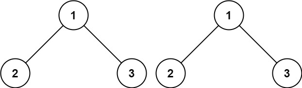

# Day 22: Same Tree

## [Question](https://leetcode.com/problems/same-tree/description/)

Given the roots of two binary trees p and q, write a function to check if they are the same or not.

Two binary trees are considered the same if they are structurally identical, and the nodes have the same value.

**Example:**

```

Given p = [1,2,3], q = [1,2,3]
Output: true
```

## Problem-Solving Ideas
1. compare both tree
2. if both are empty, same tree, return true
3. if either one of the tree is empty or the value of 1st tree is different compared to that of 2nd tree, return false
4. use DFS to continue compare for left value and right value of both tree


## Code
## in Go 

``` Go
/**
 * Definition for a binary tree node.
 * type TreeNode struct {
 *     Val int
 *     Left *TreeNode
 *     Right *TreeNode
 * }
 */
func isSameTree(p *TreeNode, q *TreeNode) bool {
    if p == nil && q == nil {
        return true
    }
    if p == nil || q == nil || p.Val != q.Val {
        return false
    }

    return isSameTree(p.Left, q.Left) && isSameTree(p.Right, q.Right)
}
```

## in Python
``` python
# Definition for a binary tree node.
# class TreeNode(object):
#     def __init__(self, val=0, left=None, right=None):
#         self.val = val
#         self.left = left
#         self.right = right
class Solution(object):
    def isSameTree(self, p, q):
        """
        :type p: TreeNode
        :type q: TreeNode
        :rtype: bool
        """
        if not p and not q:
            return True
        if not p or not q or p.val != q.val:
            return False
        return(self.isSameTree(p.left, q.left) and 
            self.isSameTree(p.right, q.right))
```

## in C++
``` C++
/**
 * Definition for a binary tree node.
 * struct TreeNode {
 *     int val;
 *     TreeNode *left;
 *     TreeNode *right;
 *     TreeNode() : val(0), left(nullptr), right(nullptr) {}
 *     TreeNode(int x) : val(x), left(nullptr), right(nullptr) {}
 *     TreeNode(int x, TreeNode *left, TreeNode *right) : val(x), left(left), right(right) {}
 * };
 */
class Solution {
public:
    bool isSameTree(TreeNode* p, TreeNode* q) {
        if(p == NULL && q == NULL)
        {
            return true;
        }
        if(p == NULL || q == NULL)
        {
            return false;
        }
        if(p->val != q->val)
        {
            return false;
        }
        return isSameTree(p->left, q->left) && isSameTree(p->right, q->right);
    }
};
```


