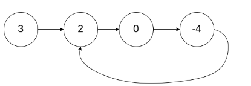

# Day 23: Linked List Cycle

## [Question](https://leetcode.com/problems/linked-list-cycle/)

Given head, the head of a linked list, determine if the linked list has a cycle in it.

There is a cycle in a linked list if there is some node in the list that can be reached again by continuously following the next pointer. Internally, pos is used to denote the index of the node that tail's next pointer is connected to. Note that pos is not passed as a parameter.

Return true if there is a cycle in the linked list. Otherwise, return false.

**Example:**

```
Given head = [3,2,0,-4], pos = 1
Output: true
Explanation: There is a cycle in the linked list, where the tail connects to the 1st node (0-indexed).
```

## Problem-Solving Ideas
#### Floyd's Tortoise and Hare
1. using slow and fast pointer, slow move 1 each time and fast move 2 each time
2. when slow and fast pointer meet each other, there is a duplicate

## Code
## in Go 

``` Go
/**
 * Definition for singly-linked list.
 * type ListNode struct {
 *     Val int
 *     Next *ListNode
 * }
 */
func hasCycle(head *ListNode) bool {
    if head == nil || head.Next == nil {
        return false;
    }
    slow := head
    fast := head

    for fast != nil && fast.Next != nil {
        slow = slow.Next
        fast = fast.Next.Next

        if slow == fast {
            return true;
        }
    }
    return false;
}
```

## in Python
``` python
# Definition for singly-linked list.
# class ListNode(object):
#     def __init__(self, x):
#         self.val = x
#         self.next = None

class Solution(object):
    def hasCycle(self, head):
        """
        :type head: ListNode
        :rtype: bool
        """
        slow, fast = head, head

        while fast and fast.next:
            slow = slow.next
            fast = fast.next.next

            if slow == fast:
                return True
        return False
```

## in C++
``` C++
/**
 * Definition for singly-linked list.
 * struct ListNode {
 *     int val;
 *     ListNode *next;
 *     ListNode(int x) : val(x), next(NULL) {}
 * };
 */
class Solution {
public:
    bool hasCycle(ListNode *head) {
        if(head == NULL)
        {
            return false;
        }
         ListNode* slow = head;
         ListNode* fast = head;

         while(fast->next != NULL && fast->next->next != NULL)
         {
             slow = slow->next;
             fast = fast->next->next;

             if(slow == fast)
             {
                 return true;
             }
         }
         return false;
    }
};
```


