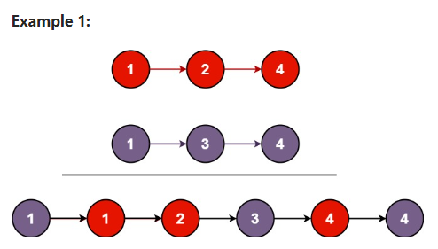

# Day 24: MergeTwoSortedLists

## [Question](https://leetcode.com/problems/merge-two-sorted-lists/description/)

You are given the heads of two sorted linked lists list1 and list2.

Merge the two lists into one sorted list. The list should be made by splicing together the nodes of the first two lists.

Return the head of the merged linked list.

**Example:**

```
Given input list1 = [1,2,4], list2 = [1,3,4]
Output: [1,1,2,3,4,4]
```

## Problem-Solving Ideas
1. compare both list value
2. the smaller one assign to the output
3. after comparing the value, in the case where if both list length are not equal, the leftover one will directly link to the end of output
4. dummy node is use as a first head node for the output


A: 1-->2-->3-->4
B: 1-->2--->5-->7-->8

output: 1-->1-->2-->2-->3-->4-->5-->7

## Code
## in Go 

``` Go

```

## in Python
``` python
# Definition for singly-linked list.
# class ListNode(object):
#     def __init__(self, val=0, next=None):
#         self.val = val
#         self.next = next
class Solution(object):
    def mergeTwoLists(self, list1, list2):
        """
        :type list1: Optional[ListNode]
        :type list2: Optional[ListNode]
        :rtype: Optional[ListNode]
        """
        dummy = ListNode()
        tail = dummy

        while list1 and list2:
            if list1.val < list2.val:
                tail.next = list1
                list1 = list1.next
            else:
                tail.next = list2
                list2 = list2.next
            tail = tail.next

        if list1:
            tail.next = list1
        elif list2:
            tail.next = list2
        return dummy.next
```

## in C++
``` C++

```


