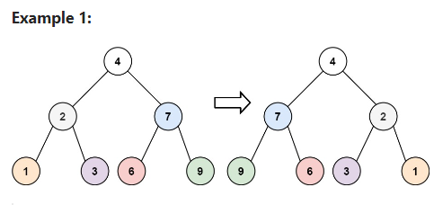

# Day 25: Invert Tree

## [Question](https://leetcode.com/problems/invert-binary-tree/description/?envType=study-plan-v2&envId=top-interview-150)

Given the root of a binary tree, invert the tree, and return its root.

**Example:**

```
Input: root = [4,2,7,1,3,6,9]
Output: [4,7,2,9,6,3,1]
```

## Problem-Solving Ideas
1. DFS approach
2. swap for both left and right subtree

## Code
## in Go 

``` Go
/**
 * Definition for a binary tree node.
 * type TreeNode struct {
 *     Val int
 *     Left *TreeNode
 *     Right *TreeNode
 * }
 */
func invertTree(root *TreeNode) *TreeNode {
    if root == nil {
        return nil
    }

    left := invertTree(root.Left)
    root.Left = invertTree(root.Right)
    root.Right = left

    return root
}
```

## in Python
``` python
# Definition for singly-linked list.
# class ListNode(object):
#     def __init__(self, val=0, next=None):
#         self.val = val
#         self.next = next
# Definition for a binary tree node.
# class TreeNode(object):
#     def __init__(self, val=0, left=None, right=None):
#         self.val = val
#         self.left = left
#         self.right = right
class Solution(object):
    def invertTree(self, root):
        """
        :type root: TreeNode
        :rtype: TreeNode
        """
        if not root:
            return None

        tmp = root.left
        root.left = root.right
        root.right = tmp

        self.invertTree(root.left)
        self.invertTree(root.right)

        return root
```

## in C++
``` C++
/**
 * Definition for a binary tree node.
 * struct TreeNode {
 *     int val;
 *     TreeNode *left;
 *     TreeNode *right;
 *     TreeNode() : val(0), left(nullptr), right(nullptr) {}
 *     TreeNode(int x) : val(x), left(nullptr), right(nullptr) {}
 *     TreeNode(int x, TreeNode *left, TreeNode *right) : val(x), left(left), right(right) {}
 * };
 */
class Solution {
public:
    TreeNode* invertTree(TreeNode* root) {
        if(root == NULL)
        {
            return NULL;
        }

        swap(root->left, root->right);

        invertTree(root->left);
        invertTree(root->right);

        return root;
    }
};
```


