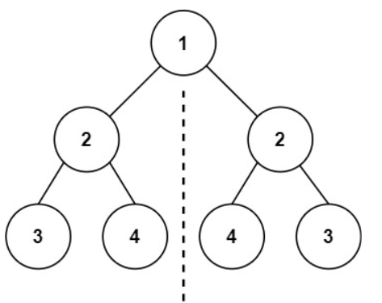

# Day 28: Symmetric Tree
## [Question](https://leetcode.com/problems/symmetric-tree/description/?envType=study-plan-v2&envId=top-interview-150)

Given the root of a binary tree, check whether it is a mirror of itself (i.e., symmetric around its center).

**Example:**


```
Given root = [1,2,2,3,4,4,3]
Output: true
```

## Problem-Solving Ideas
### Using DFS approach:
1. there is not mirror effect for root node, since there is only one root node in a tree
2. check for it's left and right node
3. if the left child node of left subtree is same as right child node of right subtree,means that there is a mirror, and return true(This is outter node checking)
4. if right child node of left subtree is same as left child node of right subtree, means there is also a mirror, and return true. (This is inner node checking).
5. If both node are empty, means there are mirror also, and return true
6. If either of them empty, means there is not mirror, return false
7. continue to call the DFS function by passing the left node and right node


## Code
## in Go 

``` Go
/**
 * Definition for a binary tree node.
 * type TreeNode struct {
 *     Val int
 *     Left *TreeNode
 *     Right *TreeNode
 * }
 */
func DFS(left *TreeNode, right *TreeNode) bool {
    if left == nil && right == nil {
        return true
    }
    if left == nil || right == nil {
        return false
    }
    return ((left.Val == right.Val) && DFS(left.Left, right.Right) && DFS(left.Right, right.Left))
}

func isSymmetric(root *TreeNode) bool {
    return DFS(root.Left, root.Right)
}
```

## in Python
``` python
# Definition for a binary tree node.
# class TreeNode(object):
#     def __init__(self, val=0, left=None, right=None):
#         self.val = val
#         self.left = left
#         self.right = right
class Solution(object):
    def isSymmetric(self, root):
        """
        :type root: TreeNode
        :rtype: bool
        """
        def dfs(left, right):
            if not left and not right:
                return True
            if not left or not right:
                return False
            
            return(left.val == right.val and dfs(left.left, right.right) and dfs(left.right, right.left))
        return dfs(root.left, root.right)
```

## in C++
``` C++
/**
 * Definition for a binary tree node.
 * struct TreeNode {
 *     int val;
 *     TreeNode *left;
 *     TreeNode *right;
 *     TreeNode() : val(0), left(nullptr), right(nullptr) {}
 *     TreeNode(int x) : val(x), left(nullptr), right(nullptr) {}
 *     TreeNode(int x, TreeNode *left, TreeNode *right) : val(x), left(left), right(right) {}
 * };
 */
class Solution {
public:

    bool DFS(TreeNode* left, TreeNode* right)
    {
        if(left == nullptr && right == nullptr)
        {
            return true;
        }
        if(left == nullptr || right == nullptr)
        {
            return false;
        }
        return ((left->val == right->val) && DFS(left->left, right->right) && DFS(left->right, right->left));
    }


    bool isSymmetric(TreeNode* root) {
        return DFS(root->left, root->right);
    }
};
```


