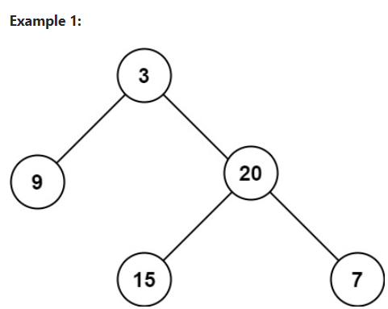

# Day 28: Symmetric Tree
## [Question](https://leetcode.com/problems/symmetric-tree/description/?envType=study-plan-v2&envId=top-interview-150)

Given the root of a binary tree, check whether it is a mirror of itself (i.e., symmetric around its center).

**Example:**


```
Given root = [1,2,2,3,4,4,3]
Output: true
```

## Problem-Solving Ideas
### Using recursive DFS approach:
#### Time complexity: O(n)
#### Space complexity: height of tree, which worst case O(n) 
1. check root, if null, return 0 
2. else, take the max of left and right subtree, and add back the 1 from root (recursive)


### Using BFS approach:
1. check root, if null, return 0
2. else, initialise a queue data structure with root, and check for that level, 
pop left inside the queue ( FIFO ), then check for the left child of that node
3. if not null, add to the queue, check for the right child of that node as well
4. increment by 1 after done checking for each level
5. return the level of the tree

### Using Iterative DFS:


## Code
## in Go 

``` Go
// Recursive DFS approach
// Time complexity: O(n)
// Space complexity: height of tree, which worst case O(n)

/**
 * Definition for a binary tree node.
 * type TreeNode struct {
 *     Val int
 *     Left *TreeNode
 *     Right *TreeNode
 * }
 */
func maxDepth(root *TreeNode) int {
	if root == nil {
		return 0
	}
	return 1 + max(maxDepth(root.Left), maxDepth(root.Right))
}
```

## in Python
``` python
# Definition for a binary tree node.
# class TreeNode(object):
#     def __init__(self, val=0, left=None, right=None):
#         self.val = val
#         self.left = left
#         self.right = right
class Solution(object):
    def maxDepth(self, root):
        """
        :type root: TreeNode
        :rtype: int
        """
        if not root:
            return 0
        return 1 + max(self.maxDepth(root.left), self.maxDepth(root.right))
```

## in C++
``` C++
// Recursive DFS approach
// Time complexity: O(n)
// Space complexity: height of tree, which worst case O(n) 

/**
 * Definition for a binary tree node.
 * struct TreeNode {
 *     int val;
 *     TreeNode *left;
 *     TreeNode *right;
 *     TreeNode() : val(0), left(nullptr), right(nullptr) {}
 *     TreeNode(int x) : val(x), left(nullptr), right(nullptr) {}
 *     TreeNode(int x, TreeNode *left, TreeNode *right) : val(x), left(left), right(right) {}
 * };
 */
class Solution {
public:
    int maxDepth(TreeNode* root) {
        if(root == nullptr)
        {
            return 0;
        }
        return (1 + max(maxDepth(root->left), maxDepth(root->right)));
        
    }
};
```


